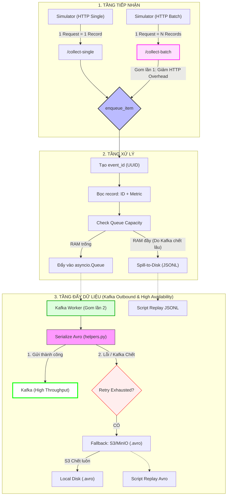

1. Ở luồng: Source -> Metrics -> Kafka
   Đang được thiết kế tối ưu cho "Single Event Ingestion"

2. Hệ thống của bạn có cơ chế spill-to-disk khi Kafka lỗi. Vậy bạn xử lý đống dữ liệu đó như thế nào? Khi nào đọc lại? Ảnh hưởng ra sao đến hệ thống?
   a. Chiến lược đọc lại
   -> Thiết kê theo Manual Disaster Recovery (khôi phục thảm họa thủ công)
   -> 1 offline worker riêng biệt để đọc các file log/avro từ đĩa và đẩy lại vào Kafka topic
   b. Thời điểm đọc lại
   -> Không chạy lúc Kafka vừa sống (vì phải chịu tải đột ngột từ hàng loạt Producer đang chờ).
   Nếu bơm thêm dữ liệu cũ -> Sập tiếp
   -> Đợi hệ thống ổn định (Dùng Grafana để kiểm tra latency và queue.size đã về mức bình thường chưa) hoặc chạy vài giờ thấp điểm
   c. Ảnh hưởng:
   - Khi các bản ghi cũ được gửi lại vào Kafka -> Gây ra vấn đề Late Arrival Data
     -> Pipeline sử dụng Event Time (thời gian sự kiện xảy ra) chứ không phải thời gian nhận được tin - Tại lớp Bronze/Silverr: việc ghi thêm dữ liệu cũ không ảnh hướng nhiều
     -> Vì Iceberg hỗ trợ commit transaction ACID (Dữ liệu cũ ~ dữ liệu mới được append vào) - Tại lớp Gold: Sử dụng cơ chế "Water mark" trong Spark để cho phép chấp nhận dữ liệu muộn trong 1 khoảng thời gian. Nếu vượt Watermark -> Ghi log ra bảng "Dead Letter Queue" -> Xử lý tay
     d. Merge với luồng chính :
     -> Replay Worker không khác gì 1 producer bình thường, nó gửi message vào cùng 1 Kafka topic
     -> Mọi thứ đều bình thường ở Kafka Broker
     -> Tuy nhiên thứ tự sẽ bị xáo trộn (vật lý)(message cũ nằm sau message mới) -> không làm sao vì đã sử dụng Event time

3. Tại sao khi retry lại cần metadata ?

- Đây là bằng chứng xác nhận đã được gửi đi
- Sau này bị Duplication hoặc thiếu, sẽ dễ tra cứu hơn khi biết vị trí của partition, vị trí của offset
  -> Log metadata giúp Traceability (Khả năng truy vết)

4. DAG là gì ? Tại sao lại thiết lập cho toàn bộ pipeline

---

## Workflow - 1: Nhận dữ liệu -> Đóng gói -> Kafka

- "serialize_batch_avro" -> Copy item ra để : + Tránh sửa đổi dữ liệu gốc vì nếu "item["payload"] = json.dumps(payload)" -> Đang trực tiếp thay đổi nội dung của object ngay trong RAM của hàng đợi (thay đổi trực tiếp đầu vào) + Nếu đang chạy được 1 nửa thì bị crash -> Dữ liệu nửa lạc nửa mở, nhưng khi retry lại lần 2 với chính batch đó -> Luôn lấy được dữ liệu sạch + .copy() giúp tách biệt hoàn toàn trạng thái dữ liệu giữa các lớp: "Lớp nhận tin API" -> "Lớp lưu trữ Queue" -> "Lớp đóng gói Avro Converter"
  -> Tips: '''Nếu áp dụng Retry thì cần phải đưa về thời điểm dữ liệu gốc gần nhất'''

- Tại sao trong main lại cần truyền vào kafka_producer "shutdown_event", trong khi KafkaProducerService cũng đã có "shutdown_event" ?
  -> Dùng ở main.py là để kết nối worker vào hệ thống điều khiển chung
  -> Còn ở KafkaProducerService thì chỉ để đảm bảo worker không bị crash nếu chạy nó độc lập (VD khi viết Unit test mà không truyền event vào)

- Tại sao cần cả 2 đầu API `/collect` (single) và `/collect-batch`?
  -> **Hỗ trợ đa dạng nguồn dữ liệu**:
  - `/collect`: Dành cho luồng "nhỏ giọt" (ví dụ: Mobile app bắn 1 lỗi ngay lập tức). Phù hợp khi traffic thấp, cần tính real-time cao nhất.
  - `/collect-batch`: Dành cho luồng "nạp nén" (ví dụ: Simulator hoặc Log Forwarder). Giúp giảm thiểu **HTTP Overhead** (Headers, Handshake), tối ưu CPU và băng thông khi traffic cực cao.
