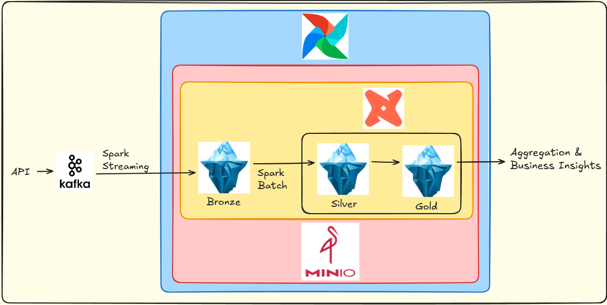

# DE_SCHEDULER

### _End-to-End Data Engineering Pipeline with Medallion Architecture & High Availability Ingestion_

[](https://github.com/dHung2412/DE_Scheduler)
[](https://github.com/dHung2412/DE_Scheduler)
[](https://github.com/dHung2412/DE_Scheduler)

**DE_SCHEDULER** là một Data Pipeline toàn diện (End-to-End) được thiết kế để thu thập, xử lý và phân tích dữ liệu sự kiện thời gian thực. Dự án tích hợp các công nghệ hiện đại nhất trong Data Engineering để giải quyết bài toán về độ tin cậy dữ liệu (Reliability), hiệu suất cao (High Throughput) và tính nhất quán (Medallion Lakehouse).

---

## 1. Các tính năng chính (Features)

- **High-Performance Ingestion**: Hỗ trợ nạp dữ liệu đơn lẻ (`/collect-single`) hoặc nạp hàng loạt (`/collect-batch`) qua FastAPI, đạt tốc độ mô phỏng lên tới ~18,000 events/giây.
- **Zero Data Loss Architecture**:
  - Cơ chế **Spill-to-disk** (RAM -> JSONL) khi hàng đợi bị đầy.
  - Cơ chế **Multi-tier Fallback** (Kafka -> S3/MinIO -> Local Disk) đảm bảo dữ liệu luôn được bảo vệ ngay cả khi hạ tầng mạng gặp sự cố.
- **Reliable Serialization**: Sử dụng **Avro Binary** kết hợp với cơ chế **Data Cloning** khi đóng gói, đảm bảo dữ liệu gốc luôn sạch để phục vụ Retry logic.
- **Medallion Lakehouse Architecture**: Dữ liệu đi qua 3 lớp:
  - **Bronze**: Lưu trữ thô từ Kafka (Apache Iceberg).
  - **Silver**: Làm phẳng, chuẩn hóa và dọn dẹp dữ liệu.
  - **Gold**: Tính toán các Business Metrics cho báo cáo.
- **ACID & Time Travel**: Tận dụng triệt để sức mạnh của **Apache Iceberg** cho các thao tác Transactional và quản lý lịch sử dữ liệu.
- **Observability**: Giám sát sâu sắc hiệu suất ứng dụng qua **Prometheus** và **Grafana**, từ latency của API đến độ trễ của Kafka Producer.

---

## 2. Công nghệ sử dụng (Tech Stack)

- **Language**: Python, SQL
- **Orchestration**: Apache Airflow.
- **Computing Engine**: Apache Spark (Structured Streaming & Batch).
- **Messaging & Buffer**: Apache Kafka, asyncio.Queue.
- **Storage**: Apache Iceberg, MinIO (S3 Compatible).
- **API Framework**: FastAPI (Asynchronous logic).
- **Monitoring**: Prometheus, Grafana.
- **Hạ tầng**: Docker, Docker Compose.

---

## 3. Kiến trúc hệ thống (System Architecture)

Dự án tuân thủ mô hình xử lý dữ liệu hiện đại, kết hợp giữa Streaming và Batch:

1.  **Collection Layer (API)**: FastAPI Service nhận dữ liệu JSON thô. Sử dụng **Shared Queue** làm vùng đệm để tách biệt việc nhận request và xử lý.
2.  **Ingestion Layer (Worker)**:
    - **Batching**: Worker gom metric từ Queue theo kích thước (1000 items) hoặc thời gian (5s).
    - **Packing**: Nén cả lô thành 1 file **Avro Binary** duy nhất.
    - **Reliability**: Gửi file Avro vào Kafka Topic `raw_metrics_avro`. Nếu lỗi, tự động ghi file xuống đĩa (Local Fallback) để Replay sau.
3.  **Bronze Layer**: Spark Structured Streaming đọc từ Kafka -> Giải mã Avro -> Ghi vào Iceberg Bronze tables.
4.  **Silver Layer**: Spark Batch (được Airflow trigger định kỳ) -> Parse JSON payload -> Làm phẳng cấu trúc dữ liệu.
5.  **Gold Layer**: dbt thực hiện các logic Business -> Tính toán metric -> Lưu trữ dữ liệu phân tích cuối cùng.



---

## 4. Hướng dẫn cài đặt (Installation & Setup)

### Yêu cầu hệ thống

- Docker & Docker Compose.
- RAM tối thiểu: 8GB (Khuyến nghị 12GB+).

### Các bước cài đặt

1.  **Clone repository**:

    ```bash
    git clone https://github.com/dHung2412/DE_Scheduler.git
    cd DE_Scheduler
    ```

2.  **Cấu hình biến môi trường**:
    Tạo file `.env` từ file mẫu hoặc thay đổi các tham số

3.  **Khởi chạy hệ thống**:

```bash
docker-compose up -d
```

4.  **Kiểm tra trạng thái**:
    - Airflow UI: `http://localhost:8080` (admin/admin)
    - Spark UI: `http://localhost:8081`
    - MinIO Console: `http://localhost:9000` (admin/admin123)
    - Grafana UI: `http://localhost:3000` (admin/admin)

---

## 5. Cách sử dụng (Usage)

### Bước 1: Chuẩn bị dữ liệu (Data Ingestion)

1.  **Khởi chạy Collector Service** (FastAPI):
    Dịch vụ này nhận dữ liệu từ nguồn ngoài và đẩy vào Kafka.

```bash
cd src/metric_collector
uvicorn app.main:app --host 0.0.0.0 --port 8000
```

### Giả lập dữ liệu (Simulator)

Sử dụng script để bắn hàng nghìn records mẫu vào hệ thống.

```bash
# Mở terminal mới tại thư mục gốc
python -m metric_collector.batch_injector
```

### Bước 2: Kích hoạt Pipeline điều phối (Airflow)

1.  Truy cập Airflow UI tại `http://localhost:8080`.
2.  Bật (Unpause) DAG `github_events_pipeline`.
3.  Kích hoạt (Trigger) DAG để thực hiện luồng: **Bronze -> Silver -> Gold** và thực hiện **dbt test**.

### Bước 3: Bảo trì hệ thống

Các DAG `maintenance_bronze_*` và `maintenance_silver_*` được thiết lập để chạy định kỳ nhằm tối ưu hóa file lưu trữ (Compaction) và dọn dẹp Metadata trên MinIO.

---

## 6. Truy vấn dữ liệu & Phân tích (Analytics)

Bạn có thể sử dụng Jupyter Notebook tích hợp sẵn để kiểm tra kết quả tại mỗi Layer:

- **Địa chỉ**: `http://localhost:8888`
- **Cách dùng**: Sử dụng Spark SQL để query các bảng trong namespaces `demo.bronze`, `demo.silver`, `demo.gold`.

---

## 5. Cấu trúc dự án (Project Structure)

```text
DE_Scheduler/
├── src/
│   ├── airflow/          # Dockerfile & Plugins cho Airflow
│   ├── dags/             # Định nghĩa DAGs và Spark Jobs
│   ├── dbt_project/      # Logic biến đổi dữ liệu với dbt
│   ├── metric_collector/ # API Gateway & Kafka Producer logic
│   ├── monitoring/       # Cấu hình Prometheus & Grafana
│   ├── utils/            # Schema (Avro) và các tài liệu bổ trợ
│   └── data/             # Dữ liệu mẫu dùng cho Simulation
├── docker-compose.yaml   # Hạ tầng Containerized
└── .env                  # Biến môi trường tập trung
```

---

## 6. Analytics & Monitoring

- **Jupyter Notebook**: `http://localhost:8888` để truy vấn SQL trên các lớp Bronze/Silver/Gold.
- **Prometheus**: `http://localhost:9090` để theo dõi các metrics hệ thống.
- **MinIO**: `http://localhost:9001` quản lý dữ liệu thô và Iceberg files.

---

_Dự án liên tục được cập nhật để áp dụng những kỹ thuật Data Engineering mới nhất._
