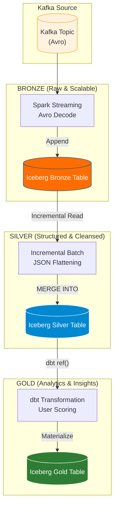

# Spark Jobs: End-to-End GitHub Events Pipeline (Bronze -> Silver -> Gold)

Tài liệu này trình bày chi tiết về các kỹ thuật và chức năng cốt lõi đã được xây dựng và tối ưu hóa cho hệ thống xử lý dữ liệu GitHub Events.

## 1. Thành tựu Nổi bật & Kết quả Đạt được

Hệ thống đã hoàn thiện chu trình dữ liệu khép kín, đạt được các chỉ số và khả năng xử lý ấn tượng:

- **Tối ưu hóa Lưu trữ (~80%)**: Nén thành công 28.599 bản ghi thô từ Kafka xuống chỉ còn **7.4 MiB** định dạng Parquet ở tầng Bronze. Điều này giúp giảm đáng kể chi phí lưu trữ và tăng tốc độ IO cho các bước xử lý sau.
- **Xử lý Avro Phức tạp**: Xây dựng Decoder UDF sử dụng `fastavro` có khả năng giải mã các Schema Avro lồng nhau với tốc độ cao, xử lý hàng chục nghìn records trong mỗi micro-batch mà không gặp lỗi tràn bộ nhớ.
- **Cơ chế Incremental Load Tối ưu**: Triển khai logic luân chuyển dữ liệu dựa trên **Native Iceberg Snapshot Tracking**. Hệ thống chỉ quét và xử lý những thay đổi thực sự (deltas), thay vì quét toàn bộ bảng (Full Scan), giúp tiết giảm tài nguyên Spark tối đa.
- **Hệ thống Phân tích Tự động (Gold Layer)**: Tự động hóa việc chấm điểm hoạt động (`activity_score`) và phân loại chuyên môn (`user_specialization`) cho hàng nghìn User ngay khi dữ liệu đổ về, cung cấp cái nhìn tức thời về đóng góp của cộng đồng.
- **Orchestration Ổn định**: DAG Airflow đã được tinh chỉnh để vận hành trơn tru giữa các nền tảng (Docker, Windows Host), với cơ chế kiểm soát lỗi (Bash Robustness) và Checkpointing thông minh trên MinIO/S3.

## 2. Chi tiết Triển khai theo Tầng (Medallion Architecture)

## 3. Các Tính năng Kỹ thuật Cốt lõi

### Quản lý Trạng thái thông minh (Watermarking)

Hệ thống không dựa hoàn toàn vào cột thời gian để lọc dữ liệu. Snapshot ID của tầng Bronze được lưu trực tiếp vào `TBLPROPERTIES` của tầng Silver. Điều này đảm bảo:

- **Exact-once processing**: Không bao giờ xử lý trùng lặp một tập dữ liệu đã ghi.
- **Fault Tolerance**: Nếu Pipeline lỗi ở giữa chừng, nó sẽ tự động bắt đầu lại đúng từ vị trí Snapshot cuối cùng thành công.

### Xử lý Cấu trúc Dữ liệu Phức tạp

Toàn bộ trường `payload` (JSON) chứa thông tin Pull Requests, Issues, Commits được hệ thống "bóc tách" (flattening) triệt để ngay tại tầng Silver. Điều này giúp:

- Chuyển đổi từ dữ liệu Semi-structured sang Structured hoàn toàn.
- Hỗ trợ các câu lệnh SQL truyền thống có thể truy vấn trực tiếp vào từng metadata của PR mà không cần hàm `get_json_object`.

### Bảo trì Bảng Tự động (Maintenance Engine)

Tích hợp sẵn bộ công cụ bảo trì để bảng Iceberg luôn ở trạng thái "khỏe mạnh":

- **Rewrite Manifests**: Tối ưu hóa việc lập kế hoạch truy vấn.
- **Expire Snapshots**: Tự động dọn dẹp các phiên bản dữ liệu cũ quá 7 ngày.
- **Rewrite Data Files (Compaction)**: Gộp hàng nghìn tập tin Parquet nhỏ thành các tập tin lớn hơn để tối ưu hóa hiệu suất đọc của ổ đĩa.

---

_Hệ thống hiện đã vận hành ổn định và sẵn sàng cho việc mở rộng quy mô dữ liệu._
