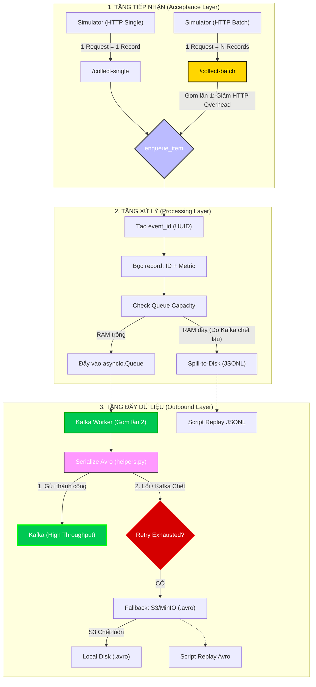

# Metric Collector Service (Simulator & Ingestion)

## 📌 Tổng quan

Metric Collector Service là một thành phần quan trọng trong pipeline dữ liệu, đóng vai trò là "Cổng tiếp nhận" (Ingestion Gateway). Dịch vụ này được thiết kế để nhận dữ liệu từ các trình giả lập (Simulators) hoặc ứng dụng thực tế, đóng gói chúng dưới dạng Avro chuẩn hóa và đẩy vào hệ thống truyền tin Kafka với hiệu suất cực cao.

## 🏗 Kiến trúc hệ thống

Hệ thống được thiết kế theo mô hình 3 tầng (3-Tier Architecture) giúp tách biệt trách nhiệm và đảm bảo tính khả dụng cao (High Availability).



### 1. Tầng Tiếp Nhận (Acceptance Layer)

Hỗ trợ cả hai phương thức nạp dữ liệu:

- **`/collect-single`**: Dành cho luồng "nhỏ giọt", ưu tiên tính Real-time.
- **`/collect-batch`**: Dành cho luồng "nạp nén", tối ưu hóa hiệu suất bằng cách giảm thiểu HTTP Overhead (Headers, Handshake). Đây là lựa chọn tối ưu cho các trình giả lập hoặc hệ thống chuyển tiếp log (Log Forwarders) với tốc độ lên tới hàng chục nghìn events/giây.

### 2. Tầng Xử Lý (Processing Layer)

- **Data Integrity**: Sử dụng cơ chế `.copy()` khi xử lý batch để đảm bảo dữ liệu gốc luôn "sạch". Điều này cực kỳ quan trọng cho cơ chế **Retry**, giúp hệ thống luôn quay về trạng thái dữ liệu gốc chính xác nhất khi có sự cố.
- **Spill-to-Disk**: Khi hàng đợi RAM bị đầy (thường do hạ tầng Kafka phía sau gặp sự cố kéo dài), hệ thống tự động tràn dữ liệu xuống đĩa cứng dưới dạng file JSONL để ngăn chặn mất mát dữ liệu và quá tải bộ nhớ.

### 3. Tầng Đẩy Dữ Liệu (Outbound Layer)

- **Worker mồ côi (Self-managed shutdown)**: Cơ chế worker sử dụng `shutdown_event` riêng biệt giúp nó có thể hoạt động độc lập (cho Unit test) và dừng lại một cách sạch sẽ khi ứng dụng chính tắt.
- **Luồng Fallback đa lớp**: Nếu Kafka từ chối kết nối, dữ liệu đã đóng gói Avro sẽ được cố gắng đẩy lên **S3/MinIO**. Nếu cả S3 cũng không khả dụng, dữ liệu cuối cùng sẽ được bảo vệ tại **đĩa cứng cục bộ**.

## 🚀 Hướng dẫn khởi động

### 1. Chạy Collector Service

Đứng tại thư mục `src/metric_collector`:

```bash
uvicorn app.main:app --host 0.0.0.0 --port 8000
```

### 2. Chạy Simulator (Bắn dữ liệu mẫu)

Đứng tại thư mục `src`:

```bash
python -m metric_collector.batch_injector
```

## 📊 Monitoring

Hệ thống tích hợp sẵn Prometheus metrics tại endpoint `/metrics`, cung cấp các chỉ số:

- Tốc độ nhận tin (RPS).
- Trạng thái hàng đợi (Queue Utilization).
- Tỷ lệ thành công/thất bại khi bắn vào Kafka.
- Thời gian xử lý Serialization.

---
